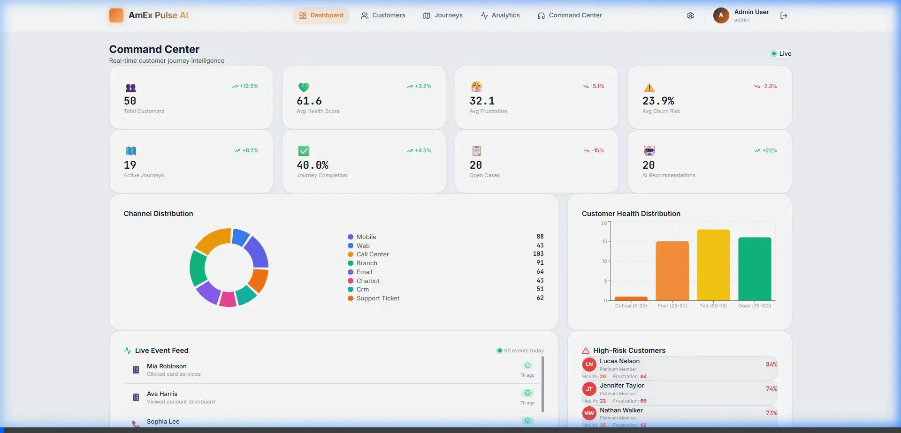
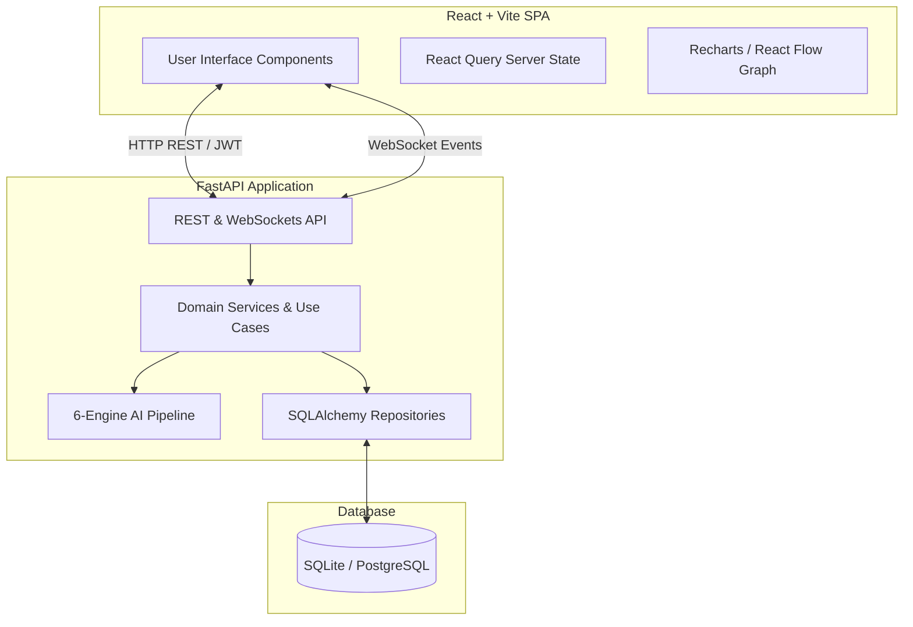

<div align="center">
  
  
  
  
  <h1>🔵 AmEx Pulse AI ⚡</h1>
  <p><b>Predict • Understand • Act</b></p>
  <p><i>American Express CodeStreet Hackathon 2026</i></p>

  [](https://opensource.org/licenses/MIT)
  [](https://reactjs.org/)
  [](https://fastapi.tiangolo.com/)
  [](https://www.python.org/)
</div>

<br />

## 🎥 Live Demonstration

Here is an automated recording of the AmEx Pulse AI platform in action, featuring our **Key Innovation: Journey Replay**:



---

## 🖼️ Key Interfaces

AmEx Pulse AI features a stunning, enterprise-grade user interface designed for maximum readability and zero friction.

### 1. Executive Dashboard
The Global Dashboard gives executives an instant pulse on the health of American Express customer journeys. It aggregates the 6-Engine AI Pipeline's outputs into real-time metrics, highlighting active churn risks and system-wide frustration levels.


### 2. Customer Profile & Behavioral Journey DNA™
The 360° Customer Profile is the core of our platform. It replaces generic event logs with a **Behavioral Journey DNA™** fingerprint. Our embedded **AI Copilot** instantly analyzes complex multi-channel failures and provides agents with a natural-language summary, a precise Recommended Next Action, and clear explainability (Reasoning & Confidence).


### 3. Journey Command Center
Designed for frontline support agents, the Journey Command Center prioritizes incoming tickets based entirely on AI-calculated Frustration and Churn Risk scores, rather than just chronological order.


### 4. Journey Analytics
Deep dive into cross-channel funnels to identify exactly where customers are dropping off. The GitHub-style **Frustration Heatmap** instantly visualizes the most painful days and hours for customer interactions, allowing product teams to rapidly identify widespread outages.


### 5. Cross-Channel Journey Explorer
A powerful graph visualization that tracks individual customer intents (like "Card Activation" or "Dispute Charge") across their entire lifecycle, stitching together seemingly unrelated touchpoints across mobile, web, and IVR.


### 6. Customer Directory
A comprehensive, AI-sorted index of the American Express customer base, allowing managers to filter directly by at-risk cohorts or specific unresolved intents.


---

## 💼 Target Business Impact (Prototype Goals)

AmEx Pulse AI is designed to drive massive operational savings and preserve customer loyalty through predictive intervention. Our estimated potential impact targets are:

1. 💰 **Support Cost Reduced:** **30% fewer repeat support calls** by identifying the root cause of cross-channel frustration.
2. ⚡ **Resolution Time Improved:** **25% faster issue resolution** powered by our AI Copilot giving agents the exact context immediately.
3. 🛡️ **Customer Retained:** **20% reduction in churn** among high-risk journeys by intervening before the customer closes their account.
4. 📈 **Money Saved:** **40% quicker identification** of broken digital funnels (e.g., activation drops) using our real-time Journey Analytics.

---

## 🎯 The Problem

Financial organizations process customer interactions across highly fragmented silos (Mobile App, Call Centers, Branches, Chatbots). Every department only sees a **fraction of the customer journey**. 

This fragmentation causes silent frustration to build up across disjointed touchpoints, driving up operational call costs and drastically increasing invisible churn risks.

---

## 💡 The AmEx Pulse AI Solution

**AmEx Pulse AI** transforms disconnected touchpoints into a **Unified Intelligent Journey Graph**. Instead of merely logging flat events, the platform generates a unique **Behavioral Journey DNA™** for every user and evaluates their real-time activity using a **6-Engine AI Pipeline**.

It predicts:
- **Root Cause of Frustration:** Exactly why the user is struggling.
- **Next Best Action (NBA):** What the agent or automated system must do right now (with full explainability).

All of this intelligence is piped via WebSockets to our premium **Journey Command Center** designed for Support Agents and Managers.

---

## 🚀 Key Innovation: Journey Replay

Instead of forcing agents to read static logs, AmEx Pulse AI features an animated **Journey Replay**. 

With a single click, the dashboard visually animates the customer's experience—showing exactly how they moved from the Mobile App ↓ to the Website ↓ to the Chatbot ↓ to the Call Center. This tells the full story of their friction instantly.

**🎥 Watch the Journey Replay in Action:**


---

## 🤔 Why Not Existing Solutions?

| Existing Systems | AmEx Pulse AI |
| :--- | :--- |
| Flat Event Logs | **Behavioral Journey Intelligence** |
| Reactive Support | **Predictive Intervention** |
| Static Dashboards | **AI Copilot Recommendations** |
| Manual Investigation | **Automated Root Cause Analysis** |
| Channel-Siloed Views | **Unified Cross-Channel Graph** |

---

## 🏗️ System Architecture

AmEx Pulse implements a strict **Clean Architecture** (Domain Driven Design) on the backend and a **Feature-Sliced Design** on the frontend.



### Clean Architecture Layers (Backend)
1. **Domain Layer:** Pure Python entities, Pydantic schemas, ENUMs. No external dependencies.
2. **Infrastructure Layer:** Database configuration, SQLAlchemy models, external API clients, auth providers.
3. **Service Layer (Use Cases):** Business logic, orchestrating AI predictions, handling business rules.
4. **API Layer (Presentation):** FastAPI routes, WebSocket endpoints, middleware, dependency injection.

---

## 🧠 The 6-Engine AI Intelligence Pipeline

The core of AmEx Pulse is its AI Pipeline (`app/ai/pipeline.py`), which runs asynchronously on every journey interaction. 

### 1. Intent Detection Engine
Analyzes the sequence of cross-channel events to deduce the overarching goal.
- *Examples:* "Card Activation", "Dispute Charge", "Credit Limit Increase", "Rewards Redemption".
- *Heuristics:* Sequences like `app_login` ➔ `view_statement` ➔ `click_dispute` reliably predict a dispute intent before the user even submits the form.

### 2. Frustration Detection Engine
Scores customer friction in real time from 0-100.
- *Signals Evaluated:* 
  - Multiple failed authentications.
  - Rapid Channel Hopping (e.g., Web ➔ Mobile ➔ Call Center in under 10 minutes).
  - Extended dwell times on error pages.
  - Repeated search queries with no results.

### 3. Customer Health Score
A composite metric (0-100) aggregating:
- Engagement Frequency (Logins, purchases).
- Payment History (On-time vs. late).
- Channel Adoption (Omnichannel vs. single channel).
- Recent Frustration Events.

### 4. Churn Prediction Engine
Outputs a probability (0.0 to 1.0) of account closure within 30 days.
- *Features considered:* Sudden drop in spend, consecutive frustration spikes, competitive credit inquiry signals (simulated), unredeemed rewards points over time.
- *Explainability:* Provides top 3 driving factors for transparency.

### 5. Next Best Action (NBA) Engine
The prescriptive layer. Based on the outputs of the previous 4 engines, it selects the optimal action to present to an agent.
- *Actions:* `fee_waiver`, `priority_callback`, `credit_increase_offer`, `rewards_bonus`, `fraud_alert`.
- *Logic Example:* If `churn_risk > 0.8` AND `intent == payment_issue`, recommend `fee_waiver` to save the relationship.

### 6. AI Journey Summary Generator
Generates natural-language executive summaries.
- *Output Example:* "Customer experienced severe friction during card activation across Web and Mobile, eventually calling Support. High frustration (85/100). Recommend priority callback."

---

## 💻 Frontend Enterprise Dashboard

The React frontend (`src/`) is styled with an exclusive, premium **AmEx Navy & Blue** design system.

### Key Features:
1. **Command Center (Dashboard Page):**
   - Live KPI counters (Open Cases, Avg Health).
   - Real-time event feed powered by WebSockets.
   - Frustration Heatmaps & Journey Funnels (Recharts).
2. **Journey Explorer (React Flow):**
   - Node-based interactive visualization.
   - Traces the user through Web ➔ Mobile ➔ Call Center with color-coded edges representing friction.
3. **Customer 360 (Profile Page):**
   - Animated Score Dials for Health, Churn, and Frustration.
   - Full timeline of stitched interactions.
   - AI prescribed Actions explicitly highlighted for the Agent.
4. **Agent Workspace:**
   - Intelligent Queue routing based on Real-Time Frustration Score (highest frustration customers are placed at the top).

---

See [Technical Architecture & Schema](docs/technical.md) for full REST API and Database details.

## 📁 Project Directory Structure

```text
amex-pulse/
├── backend/
│   ├── app/
│   │   ├── ai/
│   │   │   ├── __init__.py
│   │   │   └── pipeline.py          # 6-Engine AI orchestration
│   │   ├── api/
│   │   │   ├── v1/
│   │   │   │   ├── endpoints/       # REST Routes
│   │   │   │   │   ├── auth.py
│   │   │   │   │   ├── customers.py
│   │   │   │   │   ├── dashboard.py
│   │   │   │   │   ├── journeys.py
│   │   │   │   │   └── predictions.py
│   │   │   │   └── router.py        # API Router aggregator
│   │   │   └── websockets/
│   │   │       └── manager.py       # Real-time event publisher
│   │   ├── core/
│   │   │   ├── config.py            # Pydantic Settings
│   │   │   └── security.py          # JWT & Bcrypt logic
│   │   ├── domain/
│   │   │   ├── models/              # Pure Python Entities
│   │   │   └── schemas/             # Pydantic validation schemas
│   │   ├── infrastructure/
│   │   │   ├── database/
│   │   │   │   ├── models.py        # SQLAlchemy Models
│   │   │   │   ├── session.py       # Async engine & sessionmaker
│   │   │   │   └── seed.py          # Database generation script
│   │   │   └── repositories/        # Data Access Layer
│   │   └── main.py                  # FastAPI Entrypoint
│   └── requirements.txt
│
├── frontend/
│   ├── public/
│   ├── src/
│   │   ├── assets/
│   │   ├── components/
│   │   │   ├── layout/              # Sidebar, Topbar, Shell
│   │   │   └── ui/                  # Reusable components
│   │   ├── features/                # Feature-Sliced Design
│   │   │   ├── agent/               # Agent View page
│   │   │   ├── analytics/           # Analytics & Charts
│   │   │   ├── auth/                # Login & Auth context
│   │   │   ├── customer/            # Customer 360 profile
│   │   │   ├── dashboard/           # Main KPI Dashboard
│   │   │   ├── journey/             # React Flow Graph Explorer
│   │   │   └── settings/            # Theme & Prefs
│   │   ├── lib/
│   │   │   ├── api.ts               # Axios client & interceptors
│   │   │   └── utils.ts             # Tailwind merge, formatting
│   │   ├── App.tsx                  # React Router
│   │   ├── index.css                # AmEx Design System tokens
│   │   ├── main.tsx                 # React Root
│   │   └── types.ts                 # TypeScript Interfaces
│   ├── index.html
│   ├── package.json
│   ├── tailwind.config.js
│   ├── tsconfig.json
│   └── vite.config.ts
│
└── README.md
```

---

## 🛡️ Enterprise Security & Privacy

Since this is a financial services solution, AmEx Pulse AI is built with strict enterprise constraints:

- **PII Masking:** Customer Personally Identifiable Information is decoupled from the raw event stream.
- **Explainable AI:** All AI Copilot recommendations include transparent reasoning factors and confidence scores to prevent black-box decision making.
- **Encrypted Data:** Secure hashing (Bcrypt) and encrypted JWT transmission.
- **Role-Based Access:** Strict RBAC limits agent visibility to only their assigned cases, while analysts access anonymized aggregates.
- **Clean Architecture:** By separating the Domain layer from Infrastructure, the application can easily migrate to enterprise databases (e.g. Oracle) without touching business logic.

---

## 🛠️ Tech Stack Detailed Breakdown

| Category | Technology | Purpose | Justification for Enterprise |
|----------|------------|---------|------------------------------|
| **Frontend Framework** | React 18, Vite | High-performance SPA rendering | Industry standard for complex, state-heavy dashboards. Vite provides sub-second HMR for rapid hackathon iteration. |
| **Language** | TypeScript (Strict) | End-to-end type safety | Eliminates entire classes of runtime errors; ensures frontend interfaces perfectly match backend Pydantic schemas. |
| **Styling** | TailwindCSS + Vanilla CSS | Utility-first with custom AmEx tokens | Allows rapid scaffolding while maintaining a strict, cohesive corporate design system via CSS variables. |
| **State Management** | React Query (TanStack) | Server-state caching | Automatically handles background refetching, caching, and loading states for API calls, significantly reducing boilerplate. |
| **Data Visualization** | Recharts, React Flow | Dashboards and Journey Graphs | Recharts provides smooth SVG charting. React Flow is the gold standard for rendering interactive node-edge diagrams. |
| **Icons & UI** | Lucide React, Radix UI | Accessible, headless UI primitives | Guaranteed WCAG accessibility for components like Dialogs and Dropdowns without sacrificing custom styling. |
| **Backend Framework** | FastAPI (Python 3.12) | Async HTTP framework | Lightning fast execution utilizing ASGI. Native Pydantic support automatically generates OpenAPI documentation. |
| **Database ORM** | SQLAlchemy 2.0, Alembic | Async database operations | Provides a robust abstraction over SQL. Supports asynchronous queries, essential for non-blocking WebSocket I/O. |
| **Security** | bcrypt, PyJWT | JWT Auth and Password Hashing | Battle-tested cryptographic libraries ensuring enterprise-grade credential protection. |

---

## ⚙️ Local Development & Installation

Follow these exhaustive steps to run AmEx Pulse on your local machine.

### Prerequisites
- **Node.js**: v20.0.0 or higher.
- **Python**: v3.12.0 or higher.
- **Git**: v2.30.0 or higher.

### 1. Clone the Repository
```bash
git clone https://github.com/your-org/amex-pulse.git
cd amex-pulse
```

### 2. Backend Setup
```bash
cd backend

# Create a highly isolated Python virtual environment
python -m venv venv

# Activate the virtual environment
# On Windows (Command Prompt or PowerShell):
venv\Scripts\activate
# On macOS/Linux:
source venv/bin/activate

# Install the exact frozen dependencies required for the project
pip install -r requirements.txt

# Run the FastAPI server utilizing Uvicorn with auto-reload
# NOTE: The lifespan events in main.py will automatically initialize the SQLite DB 
# and seed it with 50 synthetic customers, ensuring your demo works immediately!
python -m uvicorn app.main:app --reload --host 0.0.0.0 --port 8000
```
*The API will be available at `http://localhost:8000`*
*Interactive Swagger UI Docs available at `http://localhost:8000/docs`*

### 3. Frontend Setup
```bash
# Open a completely new terminal window
cd frontend

# Install the Node.js dependencies specified in package.json
npm install

# Start the Vite development server with Hot Module Replacement
npm run dev
```
*The React Application will be available at `http://localhost:5173`*

### 4. Demo Credentials
The `seed.py` script automatically creates the following users. Use them to log in and explore the different RBAC views:

| Role | Email | Password | Access Level |
|------|-------|----------|--------------|
| **Admin** | `admin@amexpulse.com` | `admin123` | Full access to all dashboards, analytics, and settings. |
| **Agent** | `agent@amexpulse.com` | `agent123` | Restricted to Agent Workspace, Priority Queue, and Customer Profiles. |
| **Analyst**| `analyst@amexpulse.com`| `analyst123` | Access to Analytics, Journey Explorer, and Dashboards. |
| **Manager**| `manager@amexpulse.com`| `manager123` | Access to Agent performance metrics and high-level KPIs. |

---

## 🔮 Future Roadmap (Post-Hackathon)

While the hackathon prototype successfully demonstrates the value of Cross-Channel Journey Stitching, the following architectural enhancements are planned for production scaling:

1. **LLM Integration:** Replace the rule-based NLP summarizer with a fine-tuned open-source LLM (e.g., Llama 3 8B or Mistral 7B) deployed via vLLM. This will generate deeply contextual and generative journey summaries that adapt to nuance better than statistical heuristics.
2. **Kafka Event Streaming:** Migrate from the REST simulation to an Apache Kafka or AWS Kinesis pipeline. This is critical to ingest, buffer, and process millions of concurrent omni-channel events in a globally distributed microservices environment.
3. **Graph Database Migration:** Migrate the `Journey` and `Event` storage from a relational model (PostgreSQL) to a native Graph Database (like Neo4j or Amazon Neptune). Graph databases are mathematically optimized for traversing interconnected nodes, exponentially speeding up cross-channel similarity matching and intent prediction queries.
4. **Generative AI Agent Copilot:** Embed a chat interface within the Agent View, allowing support staff to query the customer's journey using natural language. For example, an agent could type *"Why did this customer call today?"* and receive a synthesized response citing specific digital friction events from 10 minutes prior.

---

## 📜 License & Disclaimer

**Disclaimer:** This software was created exclusively for the **American Express CodeStreet Hackathon 2026**. It is a proof-of-concept prototype demonstrating advanced software engineering and AI orchestration techniques. The synthetic data generated by the backend seeding scripts does not represent real individuals, and any resemblance to actual American Express customers, employees, or events is purely coincidental. 
